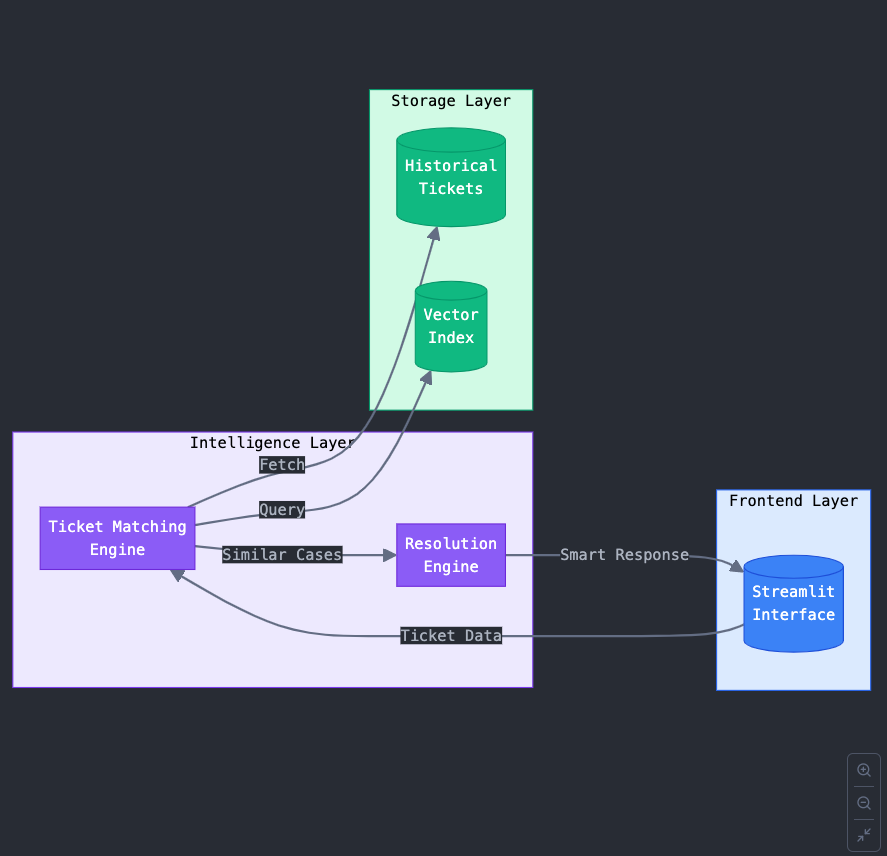

# Advanced RAG-based IT Helpdesk Assistant

This project details the development of an advanced IT Helpdesk Assistant, a sophisticated application built upon a Retrieval-Augmented Generation (RAG) framework. It showcases a robust blend of software engineering and Data Science/Machine Learning (DS/ML) skills to create a system that empowers IT support agents. By intelligently leveraging historical ticket data, the assistant provides context-aware guidance for resolving new issues. The solution is delivered as an interactive Streamlit application, utilizing state-of-the-art Hugging Face models for its core natural language processing tasks, including ticket matching and resolution suggestion.

## Problem Addressed

IT helpdesks often grapple with the challenge of redundant tickets and the inefficient use of accumulated knowledge. Support agents may not always be aware of previously resolved similar issues, leading to duplicated efforts and longer resolution times. This project addresses this by developing a system that:

1.  Intelligently matches incoming tickets to a rich database of historical tickets.
2.  Furnishes agents with actionable guidance derived from past resolutions, thereby assisting, not replacing, human expertise.

## Exploratory Data Analysis (EDA) Summary

Prior to development, an Exploratory Data Analysis (EDA) was conducted on sample ticket data (resolved and new tickets in CSV, XLSX, JSON formats). This analysis confirmed the data's structure, quality, and suitability for building a RAG system. Key fields such as `Issue`, `Category`, `Description`, and `Resolution` were identified as crucial for the retrieval and generation phases, with `Description` being particularly useful for semantic search and `Resolution` for effective retrieval.

## Approach & Architecture

The system is built on a Retrieval-Augmented Generation (RAG) architecture, divided into three primary components:

### 1. Retrieval Component (Ticket Matching System)

* **Objective**: To find and retrieve the most similar tickets from a historical knowledge base.
* **Implementation**:
    * Utilizes **Sentence Transformers** (`all-MiniLM-L6-v2`) to create vector embeddings from a combination of the `Issue`, `Category`, and `Description` fields of each ticket.
    * Employs **HNSWLib** for highly efficient vector similarity searches, retrieving the top-k most similar tickets.
    * The system retrieves both resolved and unresolved tickets, along with their similarity scores, to provide comprehensive context.

### 2. Augmentation & Generation Component (Ticket Resolution System)

* **Objective**: To generate a coherent and actionable resolution suggestion by enhancing a Large Language Model's (LLM) prompt with the retrieved ticket information.
* **Implementation**:
    * Leverages the **Hugging Face Inference API** with the `mistralai/Mixtral-8x7B-Instruct-v0.1` model.
    * Dynamically constructs prompts for the LLM based on the context of the retrieved tickets:
        * If similar **resolved** tickets are found, their successful resolutions are used to guide the response.
        * If similar **unresolved** tickets are found, their historical attempts are used to suggest potential next steps.
        * If **no matching** tickets are found, the agent is informed, preventing the generation of generic or irrelevant advice.

### 3. User Interface (Streamlit UI)

* **Objective**: To offer an intuitive and interactive interface for helpdesk agents.
* **Implementation**:
    * Agents can input the `Issue`, `Category`, and `Description` for a new ticket.
    * The application then displays the most similar historical tickets and a tailored, AI-generated response to guide the agent.

### Architecture Diagram


*(Assuming `ticket_resolution_system_architecture.png` is in the same directory as this README)*

## Technical Stack & Skills Showcased

This project demonstrates proficiency in:

* **Retrieval-Augmented Generation (RAG)**: Designing and implementing an end-to-end RAG pipeline.
* **Natural Language Processing (NLP)**:
    * Utilizing Large Language Models (e.g., `mistralai/Mixtral-8x7B-Instruct-v0.1` via Hugging Face).
    * Generating semantic embeddings using Sentence Transformers (`all-MiniLM-L6-v2`).
* **Vector Search**: Implementing efficient similarity search with HNSWLib.
* **Data Processing & Analysis**: Handling and preparing data from various formats (CSV, XLSX, JSON) using Pandas.
* **Software Engineering**:
    * Developing a full-stack application with a Python backend.
    * Building an interactive user interface with Streamlit.
* **Machine Learning Operations (MLOps) Principles**: Considerations for indexing, model serving (via API), and component-based architecture.

## Assumptions

The system operates under the following assumptions:

1.  **Data Availability**: Access to structured historical ticket data with relevant fields.
2.  **Knowledge Base & Index**: Designed to work with a consolidated knowledge base of past tickets and can leverage a pre-built vector index for faster performance.
3.  **LLM API Access**: The generation component relies on an available and responsive LLM inference endpoint (e.g., Hugging Face Inference API).
4.  **Quality of Input**: The effectiveness of the generated assistance is correlated with the clarity and relevance of the ticket information provided by the user.

## Results

The system successfully matches new tickets to similar past ones and generates coherent, context-aware guidance for agents through an intuitive Streamlit interface.

**Example Output:**
For a new ticket with the issue "Printer not connecting to WiFi", the system might:
* Display similar resolved tickets with solutions like "Restart the printer and reconnect to the WiFi network."
* Generate an AI response: "Based on past tickets, try restarting the printer and reconnecting to the WiFi network. If the issue persists, check the printer's network settings. Best, your Smart assistant."

## How to Run

1.  **Install the necessary dependencies:**
    ```bash
    pip install -r requirements.txt
    ```

2.  **Set up your Hugging Face API key (if using a model that requires it):**
    ```bash
    export HUGGINGFACE_API_KEY="your_api_key_here"
    ```

3.  **Launch the Streamlit web application:**
    ```bash
    streamlit run streamlit_app.py
    ```

4.  Open the provided URL in your browser to start using the application.

## Identified Shortcomings & Limitations

The current implementation, while functional, has areas for future improvement:

* **Scalability & Performance**: In-memory processing for the index and synchronous API calls can be bottlenecks for larger datasets or higher concurrency. Lack of caching for frequent queries.
* **Real-Time Updates & Persistence**: The vector index requires rebuilding for new data, and user interactions are not currently persisted for ongoing learning.
* **Error Handling & Resilience**: Error handling for API failures or invalid inputs is basic.
* **Architecture Limitations**: The current Streamlit-based monolithic structure might limit long-term scalability and separation of concerns.
* **Dependency on External APIs**: Reliance on external LLM APIs can introduce latency, availability risks, and potential costs that are not yet monitored.
* **Monitoring & Maintenance**: Lack of comprehensive logging, performance metrics, or a feedback loop for model improvement.
* **Model Optimization**: The chosen LLM is powerful but resource-intensive; fine-tuning smaller models could be beneficial.

## Potential Future Improvements

To enhance the system's robustness, scalability, and intelligence, the following areas are targeted for future development:

* **Improving the Underlying Algorithm**:
    * Implement **weighted matching** for different ticket fields.
    * Dynamically determine similarity thresholds.
    * Refine prompt engineering for more constrained and accurate responses.
    * Explore **smaller, fine-tuned models** for optimized performance and cost.
* **Enhancing System Design & Architecture**:
    * Integrate a dedicated **vector database** (e.g., FAISS, Pinecone, Weaviate) for efficient, scalable similarity search and real-time updates.
    * Implement **asynchronous processing** for external API calls.
    * Introduce **caching mechanisms** for frequently accessed data and LLM responses.
    * Transition towards a **microservices architecture** for better scalability and maintainability.
    * Enable **dynamic updates to the knowledge base** without full index rebuilds.
    * Store user interactions and feedback to create a continuous learning loop.
* **Error Handling & Security**:
    * Implement more **robust error handling**, retry mechanisms, and fallback strategies.
    * Introduce **input validation and sanitization**.
    * Consider **authentication and authorization** for production environments.

## Conclusion

This project delivers a functional and intelligent RAG-based system designed to significantly improve IT helpdesk efficiency. It effectively demonstrates the application of advanced software engineering and Data Science/Machine Learning techniques to solve a practical business problem. While the current implementation has identified areas for growth, it serves as a strong foundation for a highly scalable, robust, and even more intelligent IT support tool. The development journey has highlighted skills in NLP, information retrieval, LLM integration, and full-stack application development.
