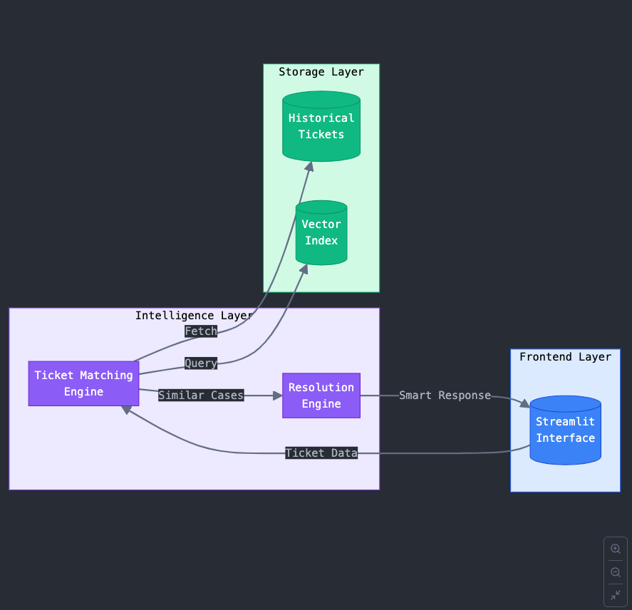

# Documentation for Aleph Alpha AI Solutions Engineer Case Study

## **Introduction**
This documentation outlines the approach, assumptions, and considerations taken to build a **Minimum Viable Product (MVP)** for the case study provided by Aleph Alpha. The goal was to create a system that assists IT helpdesk agents by leveraging previously resolved tickets to provide guidance for solving new tickets. The solution is implemented as a **Streamlit app** that uses **Hugging Face models** for ticket matching and resolution generation.

---

## **Problem Understanding**
The client runs IT helpdesks for various companies and faces the challenge of redundant tickets. Agents often lack awareness of previously resolved tickets, leading to inefficiencies. The goal is to build a feature that:
1. **Matches new tickets** to similar past tickets.
2. **Provides guidance** to agents based on past resolutions.

The solution should **assist agents** rather than fully automate the process, ensuring that human expertise remains central.

---

## **Exploratory Data Analysis (EDA) Findings**

### **1. Dataset Overview**  
The dataset consists of **resolved and new tickets** stored across multiple file formats (**CSV, XLSX, JSON**).  

#### **Resolved Tickets**  
- **30 resolved tickets** from three sources:  
  - `ticket_dump_1.csv`, `ticket_dump_2.xlsx`, `ticket_dump_3.json`.  
- Each ticket contains **8 key fields**:  
  - `Ticket ID`, `Issue`, `Category`, `Resolution`, `Date`, `Agent Name`, `Resolved`, `Description`.  

#### **New Tickets**  
- **10 new tickets** stored in `new_tickets.csv`.  
- Contains **5 fields**:  
  - `Ticket ID`, `Issue`, `Description`, `Category`, `Date`.  

### **2. Data Structure & Quality**  
- Fields are mostly **categorical** (`object`), with `Resolved` as a **boolean**.  
- **No missing values** were found.  
- **Each ticket has a unique `Ticket ID`**, ensuring data integrity.  

### **3. Key Insights**  
- **Issue & Category**: Provide structured grouping for classification.  
- **Resolution Field**: Contains valuable information for **retrieval-based solutions**.  
- **Description Field**:  
  - Captures additional context, aiding **semantic search**.  
  - **Text length distribution**:  
    - Min: **51 characters**, Max: **141 characters**, Avg: **89.5 characters**.  
- **Resolved Field**: Indicates **closed vs. open tickets**, useful for filtering relevant solutions.  

### **4. Potential Use Cases**  
- **Retrieval-Augmented Generation (RAG)**: `Issue`, `Category`, and `Resolution` fields can help improve response accuracy.  
- **Classification Models**: `Category` can be used to predict issue types.  
- **Search Optimization**: `Description` and `Resolution` aid in **vector search retrieval**.  

---

## **Approach**
The solution implements a **Retrieval-Augmented Generation (RAG)** architecture with a user interface layer. It is divided into three main components

### 1. **Retrieval Component (Ticket Matching System)**

#### **Objective:**  
Find and retrieve similar tickets from a knowledge base.  

### **Implementation:**  
- Uses **Sentence Transformers** (`all-MiniLM-L6-v2`) to generate embeddings for ticket descriptions.  
- Leverages **HNSWLib** for efficient vector similarity search to find **top-k similar tickets**.  
- Embeddings are generated using a combination of the **Issue, Category, and Description** fields.  
- Retrieves both **resolved** and **unresolved** similar tickets with similarity scores.  

### 2. **Augmentation & Generation Component (Ticket Resolution System)** 

#### **Objective:**  
Enhance **LLM prompts** with retrieved context and generate a coherent response based on similar tickets.  

### **Implementation:**  
- Utilizes **Hugging Face Inference API** with `mistralai/Mixtral-8x7B-Instruct-v0.1`.  
- Augments LLM prompts with retrieved **similar tickets and their resolutions**.  
- Generates responses based on context type:  
  - **With Resolved Tickets:** Leverages successful historical solutions.  
  - **With Unresolved Tickets:** Suggest potential next steps based on historical attempts.  
  - **No Matching Tickets:** In case of no matching past tickets found, informs the agent accordingly.

### 3. **User Interface Layer (Streamlit UI)**

#### **Objective**: Provide a user-friendly interface for agents to interact with the **RAG system**.

#### **Implementation**:
  - Agents input the **Issue**, **Category**, and **Description** of a new ticket.
  - The app displays:
    - **Similar Tickets**: Top `k` resolved or unresolved tickets.
    - **AI-Generated Response**: A suggested resolution or guidance for the agent.

### **Architecture Diagram**
Below is the architecture diagram for the system:




---

## **Assumptions**
1. **Data Format**: The ticket data is assumed to be in a structured format with fields like `Issue`, `Category`, `Description`, `Resolved`, and `Resolution`.
2. **Historical Ticket Data & Pre-built Index**:  
   The system relies on an aggregated data file (`combined_data.csv`) that stores past ticket details in the specified `data-format`. Additionally, to ensure a faster Streamlit app, it assumes the presence of a cached pre-built index (`ticket_index.bin`).

3. **API Availability**: The solution relies on the Hugging Face Inference API, assuming it is available and responsive.
4. **User Input**: Agents will provide **clear and relevant input** for the system to generate meaningful responses.

---

## **Results**
The MVP successfully:
1. **Matches Tickets**: Finds similar tickets based on user input.
2. **Generates Responses**: Provides coherent guidance for agents based on resolved or unresolved tickets.
3. **Provides a User Interface**: Offers a simple and intuitive interface for agents to interact with the system.

### **Example Output**
For a new ticket with the issue **"Printer not connecting to WiFi"**, the system might:
- Display similar resolved tickets with solutions like **"Restart the printer and reconnect to the WiFi network."**
- Generate an AI response: **"Based on past tickets, try restarting the printer and reconnecting to the WiFi network. If the issue persists, check the printer's network settings. Best, your Smart assistant."**

---
## **How to Run the Code**
1. Install the required dependencies:
   ```bash
   pip install -r requirements.txt

   export HUGGINGFACE_API_KEY="your_api_key_here"
2. Launch streamlit web application
   ```bash
   streamlit run streamlit_app.py
3. Open the app in your browser and input the ticket details to see the results.

---

## **Shortcomings**  

While the current system implements a **Retrieval-Augmented Generation (RAG)** approach effectively, it has several limitations that impact scalability, performance, and maintainability.  

### 1. Scalability & Performance  
- **In-Memory Processing:** The system may struggle with large datasets due to memory constraints.  
- **Inefficient Vector Search:** Every request triggers a fresh vector search, even for repeated queries.  
- **Synchronous API Calls:** UI performance may degrade due to blocking calls to external APIs.  
- **Lack of Caching:** No caching mechanism for frequently requested tickets, leading to redundant computations.  

### 2. Real-Time Updates & Persistence  
- **Index Rebuilding Overhead:** The vector index must be rebuilt every time new tickets are added, making real-time updates inefficient.  
- **No Interaction Storage:** User interactions and resolutions are not stored for future learning or analysis.  

### 3. Error Handling & Resilience  
- **No Robust Error Handling:** The system lacks mechanisms to handle model failures or API downtime.  
- **No Retry Mechanisms:** Failed API calls do not have automated retries.  
- **Missing Fallback Strategy:** If the LLM service is unavailable, the system has no alternative response mechanism.  
- **Lack of Input Validation:** User inputs are not thoroughly validated or sanitized.  

### 4. Architecture Limitations  
- **Monolithic Streamlit Instance:** Everything runs in a single instance, limiting scalability.  
- **No Separation of Services:** The vector search and LLM components are tightly coupled.  
- **Local File Dependencies:** The system relies on local files (`index_path`, `resolved_tickets_path`), restricting flexibility.  

### 5. Dependency on External APIs  
- **Latency & Availability Risks:** The system depends on the Hugging Face API, which may introduce delays and potential service disruptions.  
- **API Cost & Usage Monitoring:** There is no tracking of API usage or costs, which could lead to unexpected expenses.  


### 6. Monitoring & Maintenance  
- **No Logging System:** Errors and performance metrics are not tracked.  
- **No Model Telemetry:** The system lacks insights into how well the model is performing.  
- **No Feedback Loop:** User interactions are not leveraged to improve future responses.  

### 7. Model Optimization  
- **Heavy Model Usage:** The current LLM (`mistralai/Mixtral-8x7B-Instruct-v0.1`) is resource-intensive.  
- **Lack of Fine-Tuning:** Using a smaller, fine-tuned model could reduce inference time and costs.  

---
## **Future Improvements**  

If more time and resources were available, the following improvements could be made to enhance scalability, performance, and usability. 

### 1. **Improving the Underlying Algorithm**  

- **Weighted Matching for Ticket Components:** Assign different importance levels to fields like **Category** to improve retrieval accuracy.  
- **Optimized Similarity Threshold:** Instead of using a fixed **K=3**, determine the best threshold using domain knowledge and data.  
- **Better Prompt Engineering:** Ensure the model limits solutions to the knowledge base rather than generating generic responses when no resolved ticket is found.  
- **Model Optimization:**  
  - Use **smaller, fine-tuned models** for faster inference and lower resource usage.  
  - Experiment with **low-latency models** optimized for real-time retrieval and generation.  

### 2. **Enhancing System Design**  

#### **Scalability & Performance**  
- **Vector Database Integration:** Replace the in-memory index with a **vector database** (e.g., **FAISS, Pinecone**) for efficient similarity search and real-time updates.  
- **Asynchronous Processing:** Implement **async processing** to handle multiple requests concurrently without blocking UI interactions.  
- **Caching for Faster Responses:** Implement caching for **frequent queries** to reduce redundant computations and improve response time.  

#### **Real-Time Updates & Persistence**  
- **Dynamic Knowledge Base Updates:** Enable users to **add new tickets** dynamically without requiring a full index rebuild.  
- **Store User Interactions:** Log past queries and generated responses to **improve model performance** over time.  

#### **Architectural Improvements**  
- **Microservices Architecture:** Break the monolithic system into separate services for:  
  - Vector search  
  - Language model inference  
  - UI layer  
- **Adjustable Search Parameters:** Provide power users with controls to **tweak K-values and similarity thresholds** for fine-tuning retrieval.  
- **Improved Testing & Validation:** Develop **dedicated testing modules** to ensure robustness in data ingestion, model inference, and API interactions.  

#### **Error Handling & Security**  
- **Robust Error Handling:** Implement proper error handling for:  
  - API failures  
  - Invalid inputs  
  - Index loading issues  
- **Security Enhancements:**  
  - Implement authentication & authorization mechanisms to restrict access.  

These improvements will significantly enhance the system’s accuracy, flexibility, and overall performance. 🚀  

---

## **Conclusion**
The MVP provides a functional solution for assisting IT helpdesk agents by leveraging past ticket resolutions. While the system has some limitations, it demonstrates a clear approach to solving the problem and provides a foundation for future improvements. With additional time and resources, the system could be enhanced to handle larger datasets, improve scalability, and provide a more robust user experience.

---
